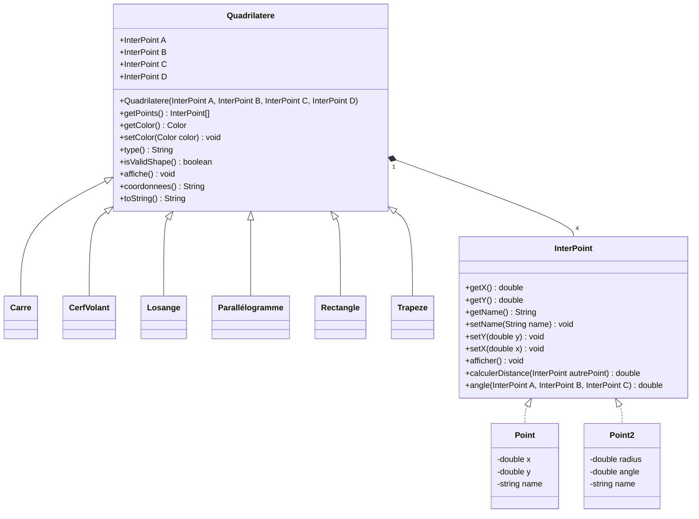

# TD POO JavaFX

## Informations générales

- Réalisé par : **Maxime MONET** et **Arthur PALY**
- Version du compilateur : **Java SDK 17.0.2**
- Classe principale : [Main.java](src/main/java/mtx/dev/tp1javafx/Main.java)
- Classe de lancement : [App.java](src/main/java/mtx/dev/tp1javafx/Launcher.java)
- Documentation : [JavaDoc](https://mtx.dev/tp1javafx)
- GitHub : [ArthurMTX/TP1JavaFX](https://github.com/ArthurMTX/TP1JavaFX)

## Respect des consignes

- [x] **1.** Créer une classe [Point.java](src/main/java/mtx/dev/tp1javafx/Point.java) qui permet de représenter un point cardinal dans un plan.
- [x] **2.** Créer une classe [Quadrilatere.java](src/main/java/mtx/dev/tp1javafx/Quadrilatere.java) qui permet de représenter un quadrilatère quelconque.
  - méthode `affiche()` qui affiche le type du quadrilatère et ses coordonnées.
  - méthode `coordonnees()` qui retourne les coordonnées du quadrilatère sous forme de chaîne de caractères.
  - méthode `type()` qui retourne le type du quadrilatère sous forme de chaîne de caractères.
  - redéfinition de `toString()` qui retourne le type du quadrilatère et ses coordonnées sous forme de chaîne de caractères.
- [x] **3.** Créer une classe [Carre.java](src/main/java/mtx/dev/tp1javafx/Carre.java), [CerfVolant.java](src/main/java/mtx/dev/tp1javafx/CerfVolant.java), [Losange.java](src/main/java/mtx/dev/tp1javafx/Losange.java), [Parallelogramme.java](src/main/java/mtx/dev/tp1javafx/Parallelogramme.java), [Rectangle.java](src/main/java/mtx/dev/tp1javafx/Rectangle.java) et [Trapeze.java](src/main/java/mtx/dev/tp1javafx/Trapeze.java) qui héritent de la classe [Quadrilatere.java](src/main/java/mtx/dev/tp1javafx/Quadrilatere.java).
  - redéfinition de `toString()` qui retourne le type du quadrilatère et ses coordonnées sous forme de chaîne de caractères.
  - redéfinition de `type()` qui retourne le type du quadrilatère sous forme de chaîne de caractères.
  - redéfinition de `affiche()` qui affiche le type du quadrilatère et ses coordonnées.
- [x] **4/5.** Créer une classe spécifique au programme [Main.java](src/main/java/mtx/dev/tp1javafx/Main.java) qui permet de créer des instances de ces classes et de les tester.
- [x] **6.** Créer une classe [Point2.java](src/main/java/mtx/dev/tp1javafx/Point2.java) qui permet de représenter un point polaire dans un plan.
- [x] **7.** Créer une interface [InterPoint.java](src/main/java/mtx/dev/tp1javafx/InterPoint.java) que les classes [Point.java](src/main/java/mtx/dev/tp1javafx/Point.java) et [Point2.java](src/main/java/mtx/dev/tp1javafx/Point2.java) implémentent.
- [x] **8.** Découplage des classes [Point.java](src/main/java/mtx/dev/tp1javafx/Point.java) et [Point2.java](src/main/java/mtx/dev/tp1javafx/Point2.java) de la classe [Quadrilatere.java](src/main/java/mtx/dev/tp1javafx/Quadrilatere.java) grâce à l'interface [InterPoint.java](src/main/java/mtx/dev/tp1javafx/InterPoint.java) et à la classe [FabriquePoint.java](src/main/java/mtx/dev/tp1javafx/FabriquePoint.java).
- [x] **9.** Éliminer les dépendances aux classes dans [FabriquePoint.java](src/main/java/mtx/dev/tp1javafx/FabriquePoint.java) grâce à la réflexivité (création d'une instance de classe dynamiquement).
- [x] **10.** Découplages des classes [Carre.java](src/main/java/mtx/dev/tp1javafx/Carre.java), [CerfVolant.java](src/main/java/mtx/dev/tp1javafx/CerfVolant.java), [Losange.java](src/main/java/mtx/dev/tp1javafx/Losange.java), [Parallelogramme.java](src/main/java/mtx/dev/tp1javafx/Parallelogramme.java), [Rectangle.java](src/main/java/mtx/dev/tp1javafx/Rectangle.java) et [Trapeze.java](src/main/java/mtx/dev/tp1javafx/Trapeze.java) de la classe [Quadrilatere.java](src/main/java/mtx/dev/tp1javafx/Quadrilatere.java) grâce à la classe [FabriqueQuadrilatere.java](src/main/java/mtx/dev/tp1javafx/FabriqueQuadrilatere.java).
- [x] **11.** Éliminer les dépendances aux classes dans [FabriqueQuadrilatere.java](src/main/java/mtx/dev/tp1javafx/FabriqueQuadrilatere.java) grâce à la réflexivité (création d'une instance de classe dynamiquement).
- [x] **12.** Créer une interface graphique avec JavaFX permettant de créer des quadrilatères et de les afficher.

## Exemple de quadrilatères

### Carre 

Coordonnées à saisir : `0;0 0;10 10;10 10;0`

### Rectangle

Coordonnées à saisir : `0;0 0;10 20;10 20;0`

### Parallélogramme

Coordonnées à saisir : `0;0 0;10 20;20 20;10`

### Losange

Coordonnées à saisir : `0;0 0;10 10;20 20;10`

### Trapèze

Coordonnées à saisir : `0;0 0;10 20;20 20;10`

### Cerf-volant

Coordonnées à saisir : `0;0 0;10 10;20 20;10 20;0`

## Architecture du projet

