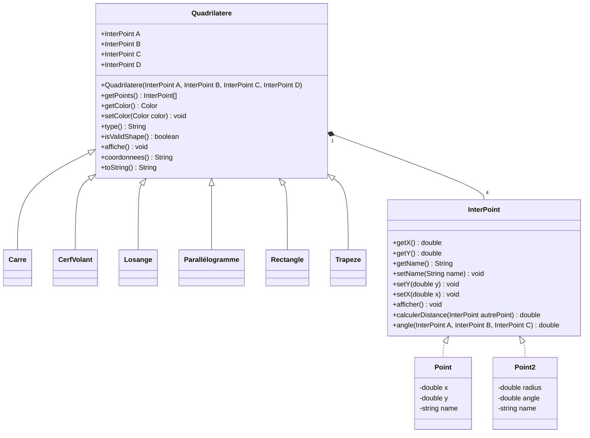

```mermaid
classDiagram
    Quadrilatere <|-- Carre
    Quadrilatere <|-- CerfVolant
    Quadrilatere <|-- Losange
    Quadrilatere <|-- Parallélogramme
    Quadrilatere <|-- Rectangle
    Quadrilatere <|-- Trapeze
    class Quadrilatere {
        +InterPoint A
        +InterPoint B
        +InterPoint C
        +InterPoint D
        
        +Quadrilatere(InterPoint A, InterPoint B, InterPoint C, InterPoint D)
       
        +getPoints() InterPoint[]
        +getColor() Color
        +setColor(Color color) void
        +type() String
        +isValidShape() boolean
        +affiche() void
        +coordonnees() String
        +toString() String
    }
    class InterPoint {
        +getX() double
        +getY() double
        +getName() String
        +setName(String name) void
        +setY(double y) void
        +setX(double x) void
        +afficher() void
        +calculerDistance(InterPoint autrePoint) double
        +angle(InterPoint A, InterPoint B, InterPoint C) double
    }
    class Point {
        -double x
        -double y
        -string name
    }
    class Point2 {
        -double radius
        -double angle
        -string name
    }
    InterPoint <|.. Point
    InterPoint <|.. Point2
    Quadrilatere "1" *-- "4" InterPoint
```